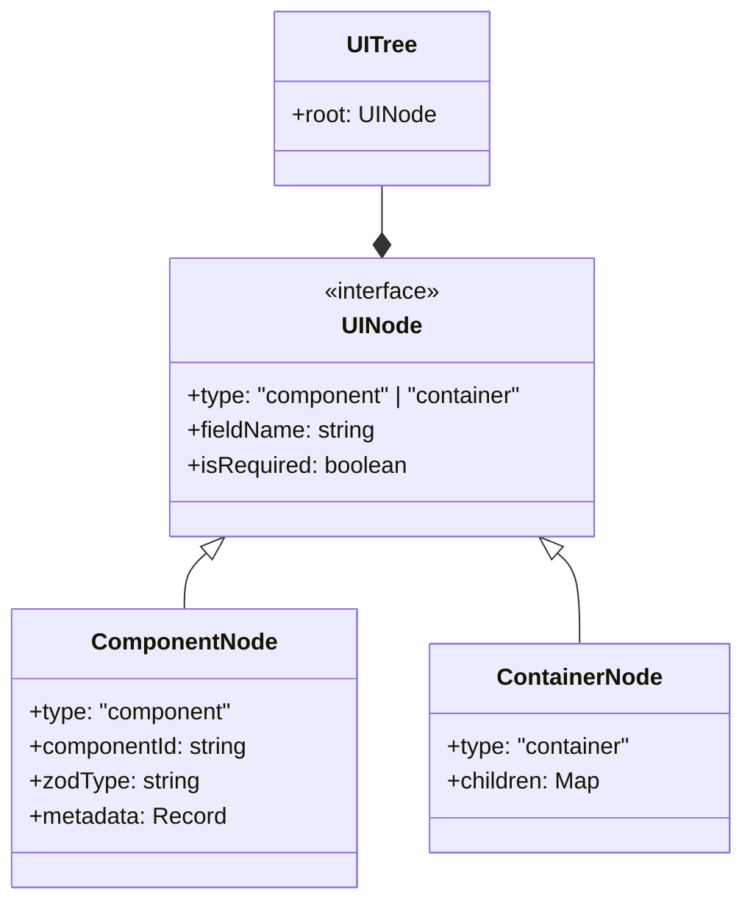

# Data Model: Enhance Reading Schema

**Branch**: `002-enhance-reading-schema` | **Date**: 2026-01-02

## Core Entities

### 1. UI Tree (Intermediate Representation)
 The `UITree` is the language-agnostic result of the `SchemaResolver`. It represents the resolved structure of the UI to be generated.

### 2. Component Registry
Mapping used by the Resolver to determine Component IDs.

| Source | Priority | Example |
| :--- | :--- | :--- |
| **Metadata** | 1 (Highest) | `.describe("ui:textarea")` |
| **Config** | 2 | `zo.config.json: { "zod.string": "textarea" }` |
| **Default** | 3 (Lowest) | `zod.string` -> `input-text` |

### 3. Generated File
Atomic unit of output from an Adapter.

fields:
- `filename`: string (e.g., `UserForm.svelte`)
- `content`: string (Source code)
